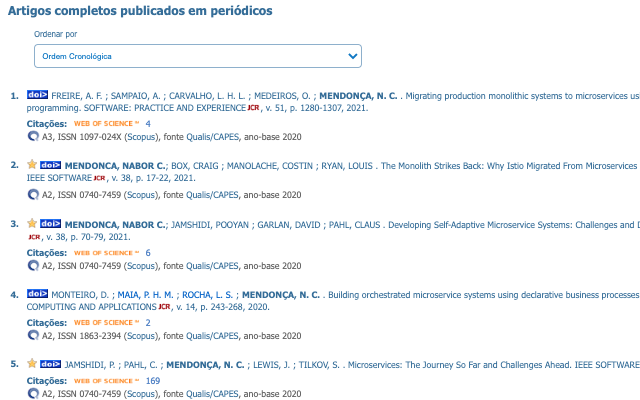
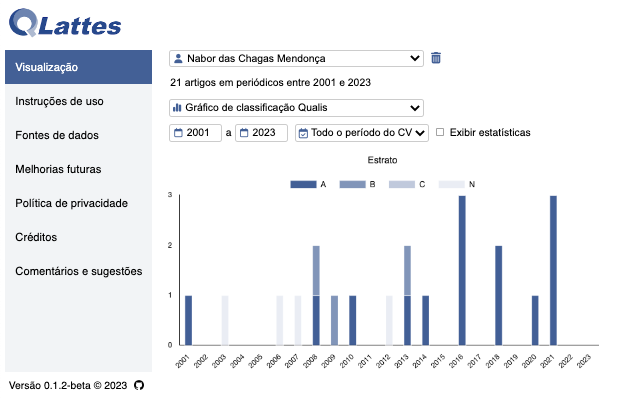
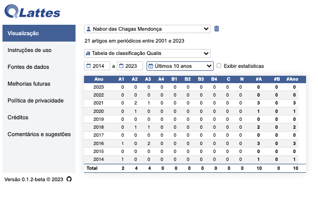
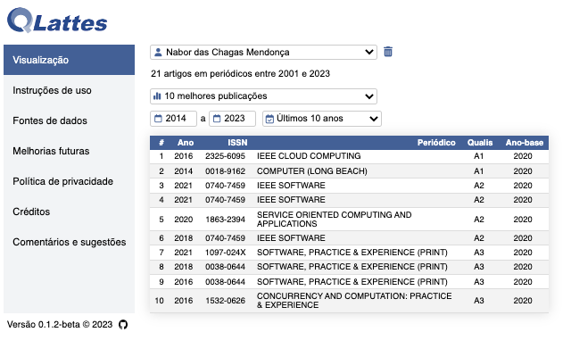

QLattes é uma extensão do Chrome que automaticamente classifica os artigos em periódicos identificados nas páginas dos CVs da [Plataforma Lattes](https://lattes.cnpq.br/) do CNPq, de acordo com o novo Qualis da CAPES.

* [Instalação](#instalação)
* [Instruções de uso](#instruções-de-uso)
* [Fontes de dados](#fontes-de-dados)
* [Melhorias futuras](#melhorias-futuras)
* [Política de privacidade](#política-de-privacidade)
* [Créditos](#créditos)
* [Comentários e sugestões](#comentários-e-sugestões)

## Instalação

Há duas maneiras de instalar a QLattes: da [Chrome Web Store](https://chrome.google.com/webstore/) e manualmente.

### Instalação da Chrome Web Store

Abra a [página da QLattes](https://chrome.google.com/webstore/detail/cobekobjpobenpjdggbpkkklkcfoinen) na Chrome Web Store e clique no botão "Usar no Chrome". Se tiver dúvidas sobre a instalação, leia as instruções disponíveis [neste link](https://support.google.com/chrome_webstore/answer/2664769?hl=pt-BR).

Nesta primeira versão pública (beta), a extensão está publicada no modo não listado, o que significa que qualquer um pode instalar a ferramenta com o link acima, mas esta ainda não aparece nas buscas.

### Instalação manual

Baixe o arquivo [.zip](https://github.com/nabormendonca/qlattes/archive/refs/heads/main.zip) com o código fonte deste repositório para o seu computador. Após descompactar o arquivo, os aquivos necessários para a instalação manual da QLattes estarão na pasta "dist". Localize o caminho para esta pasta e siga as intruções disponíveis [aqui](https://canaltech.com.br/navegadores/como-instalar-extensao-no-google-chrome-manualmente/).

## Instruções de uso

Após a instalação da QLattes, abra a página de um ou mais CV Lattes no seu navegador Chrome ou em outro navegador derivado da plataforma [Chromium](https://www.chromium.org/Home/) (por exemplo, [Microsoft Edge](https://www.microsoft.com/edge), [Opera](https://www.opera.com/), e [Brave](https://brave.com/)).

QLattes automaticamente anotará os dados da classificação Qualis dos artigos completos em periódicos diretamente nas páginas dos CVs. Navegue até a seção de "Artigos completos publicados em periódicos" dos CVs para visualizar as anotações, localizadas logo abaixo das informações de cada artigo (ver exemplo abaixo).

As anotações adicionadas pela ferramenta incluem a classificação Qualis e o ISSN do periódico no qual o artigo foi publicado, o link para a página do periódico na Scopus (quando disponível), e a fonte de dados e o ano-base utilizados para classificar o periódico.

### Visualização dos dados

Para visualizar os dados de classificação dos artigos de forma consolidada, abra a página da ferramenta clicando no ícone da extensão em seguida clique no menu "Visualização", na barra lateral. Após selecionar um CV, QLattes oferecerá diferentes opções para o usuário filtrar e visualizar os dados do CV por período. Para ajustar o período de visualização, utilize as opções de manipulação dos anos inicial e final do período, ou escolha um dos períodos pré-selecionados pela ferramenta.

A atual versão da QLattes implementa quatro tipos de visualização:

* Gráfico de classificação Qualis
* Tabela de classificação Qualis
* 5 melhores publicações
* 10 melhores publicações

As duas primeiras visualizações exibem, na forma de um gráfico e de uma tabela, respectivamente, a quantidade de artigos encontrados no CV para cada estrato do Qualis, consolidados por ano (ver exemplos abaixo). Além disso, ambas visualizações oferecem a opção de exibir estatísticas como a média, a mediana, e a tendência de alguns indicatores para o período selecionado. A tendência é calculada pela inclinação da reta obtida via regressão linear sobre os números de publicações de cada indicador agregado ao longo do período selecionado.

A visualização na forma de gráfico possui elementos visuais ativos. Passe o mouse sobre os elementos do gráfico para revelar os respectivos valores. Clique nos elementos da legenda para ocultar/exibir os elementos do gráfico referentes a estratos específicos do Qualis.

As duas últimas visualizações, como os nomes sugerem, mostram os dados das 5/10 publicações mais bem classificadas no Qualis no período selecionado (ver exemplo abaixo). O ranque das publicações é criado com base na classificação Qualis de cada publicação, com o ano de publicação sendo utilizado como critério de desempate (publicações mais recentes são exibidas à frente de publicações mais antigas).

Artigos publicados em periódicos cujo ISSN não foram encontrado em nenhuma das fontes de dados utilizadas pela ferramenta são anotados nas páginas dos CVs como "Não classificado." QLattes representa os números referentes aos artigos não classificados atribuindo-lhes o estrato "N" nas diferentes visualizações que exibe.

### Remoção dos dados

Os dados extraídos e consolidados pela QLattes podem ser removidos a qualquer momento pelo usuário. Para isso, basta clicar no botão em formato de lixeira, localizado ao lado do nome da pessoa autora do CV. A ferramenta solicitará ao usuário que confirme a remoção dos dados do CV, antes de removê-los em definitivo. Uma vez confirmada a remoção dos dados, será necessário atualizar ou (re)abrir a página do CV para visualizar seus dados novamente.

## Fontes de dados

QLattes utiliza três fontes de dados para classificar os artigos em periódico, todas incluídas junto com a ferramenta:

* fonte de dados da CAPES
* fonte de dados da PUC-RS
* fonte de dados da Scopus

### Fonte de dados da CAPES

Os dados desta fonte foram coletados da [Plataforma Sucupira](https://sucupira.capes.gov.br/sucupira/public/index.xhtml) da CAPES, ao final de 2022, e incluem a classificação Qualis de 31.337 periódicos de todas as áreas do conhecimento (ano-base 2020).

### Fonte de dados da PUC-RS

Os dados desta fonte foram coletados da página do Qualis da [PUC-RS](https://ppgcc.github.io/discentesPPGCC/pt-BR/qualis/), em dezembro de 2022, e incluem a classificação Qualis e o percentil Scopus de 2.190 periódicos (ano-base 2021), predominantemente da área de Ciência da Computação.

### Fonte de dados da Scopus

Os dados desta fonte foram coletados do [portal da Scopus](https://www.scopus.com/sources.uri), em maio de 2021, e incluem os percentis de 25.990 periódicos internacionais de todas as áreas do conhecimento (ano-base 2020). QLattes classifica os periódicos encontrados exclusivamente nesta fonte tomando como base as [regras de distribuição de percentis](https://www.in.gov.br/en/web/dou/-/portaria-n-145-de-10-de-setembro-de-2021-344468240) estabelecidas pela CAPES:

| Classificação	| Distribuição |
| :---: | :---: | 
| A1	| percentil ≥ 87,5 |
| A2	|	75 ≤ percentil < 87,5 |
| A3	|	62,5 ≤ percentil < 75 |
| A4	|	50 ≤ percentil < 62,5 |
| B1	|	37,5 ≤ percentil < 50 |
| B2	|	25 ≤ percentil < 37,5 |
| B3	|	12,5 ≤ percentil < 25 |
| B4	|	percentil < 12,5 |

### Método de busca

QLattes consulta uma fonte de dados de cada vez, por ordem de atualização dos dados de cada fonte, da mais recente (CAPES) à mais antiga (Scopus), utilizando o ISSN dos periódicos extraído do CVs como chave de busca. Se os dados de um periódico não forem encontrados na primeira fonte de dados consultada, a ferramenta busca esses dados na próxima fonte de dados, e assim sucessivamente.

### Critérios de Inclusão

Cada uma das três fontes de dados inclui apenas as informações referentes à melhor classificação no Qualis, ou o maior percentil, de cada periódico, independentemente de área de conhecimento. Esta decisão está em conformidade com a atual política de classificação de periódicos adotada pela CAPES, e foi tomada para melhorar a eficiência da ferramenta e reduzir seu consumo de recursos no navegador.

Embora as três fontes possuam dados redundantes, com a classificação ou o percentil Scopus de muitos periódicos estando presente em mais de uma delas, o fato de cada fonte incluir dados de periódicos inexistentes nas outras fontes justifica a incorporação das três fontes pela ferramenta.

## Melhorias futuras

Essas são algumas das melhorias sendo atualmente consideradas para futuras versões da QLattes:

* exibição dos dados consolidados de múltiplos CVs
* integração com outras fontes de classificação de veículos científicos
* classificação dos artigos publicados em eventos

### Exibição dos dados de múltiplos CVs

Esta funcionalidade facilitaria a comparação da produção de um grupo de pessoas, por exemplo, os membros de um determinado corpo docente, departamento, ou instituição. Além de envolver o re-desenho das visualizações atualmente implementadas, outro desafio aqui é o fato da Plataforma Lattes (ou pelo menos a sua interface web nativa) não permitir o acesso aos dados dos CVS em bloco. Ou seja, mesmo que a ferramenta permitisse a visualização dos dados de múltiplos CVs simultaneamente, esses dados ainda teriam que ser extraídos abrindo-se as páginas dos CVs uma a uma.

### Integração com outras fontes de métricas

Uma extensão natural da ferramenta seria permitir a visualização dos dados dos CVs integrados aos dados das mesmas pessoas obtidos de outras fontes de métricas acadêmicas, como [Google Acadêmico](https://scholar.google.com/) e [CSIndexbr](https://csindexbr.org/). O desafio, nesse caso, seria a necessidade da ferramenta acessar essas fontes externas durante o processamento dos dados dos CVs, o que poderia afetar a sua eficiência e resiliência.

### Classificação de eventos

O desafio aqui é o fato dos eventos não possuírem um identificador único, como o ISSN dos periódicos. Sem tal identificador, a classificação dos eventos tem que ser feita com base apenas na informação sobre os eventos registradas nos CVs, que, em essência, não possui uma estrutura bem definida. Isso aumenta o risco da classificação automática dos eventos conter muitos falsos positivos ou falsos negativos.

Uma alternativa interessante seria utilizar a própria ferramenta como uma plataforma colaborativa para treinamento supervisionado de modelos de aprendizado de máquina criados especificamente para identificar eventos nas informações contidas nos CVs Lattes. Por exemplo, a ferramenta poderia sugerir a classificação dos eventos registrados no CV, e o usuário então confirmaria ou revisaria a classificação sugerida.

Voluntários e colaboradores para implementar essas e outras melhorias são muito bem vindos!

## Política de privacidade

QLattes foi desenvolvida como um projeto pessoal, de código aberto, sem qualquer vínculo com a CAPES, o CNPq ou outras entidades governamentais.

A ferramenta incorpora e utiliza dados de classificação de periódicos publicamente disponíveis. A extração, a classificação, e o armazenamento dos dados das publicações são feitos internamente, no próprio navegador, sem acessar nenhuma API ou serviço remoto.

## Créditos

Concepção e implementação: [Nabor Mendonça](https://sites.google.com/site/nabormendonca/) (UNIFOR)

Consultoria de conteúdo: Andréia Formico (UNIFOR)

Consultoria técnica: Lucas Mendonça (Instituto Eldorado)

Consultoria sobre a fonte de dados da CAPES: André Luiz F. Batista (IFTM-MG)

Criação da fonte de dados da PUC-RS: Olimar Borges (PUC-RS)

Logo: variação sobre os logos do Qualis e da Plataforma Lattes

## Comentários e sugestões

Utilize [este formulário online](https://forms.gle/ZzHWNSsKUPHBK1WK8) para enviar uma mensagem com comentários, sugestões, relatos de bug, ou simplesmente compartilhar a sua opinião sobre a ferramenta.

