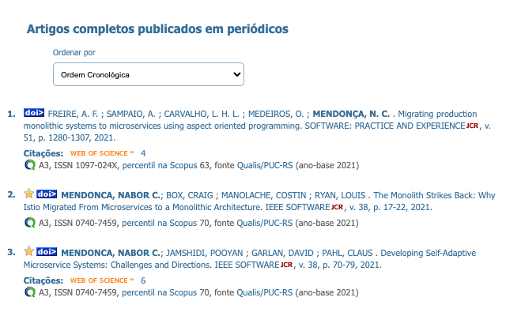

QLattes é uma extensão do Chrome que automaticamente classifica os artigos em periódicos identificados nas páginas dos CVs da [Plataforma Lattes](https://lattes.cnpq.br/) do CNPq, de acordo com o Qualis da CAPES.

* [Instalação](#instalação)
* [Instruções de uso](#instruções-de-uso)
* [Política de privacidade](#política-de-privacidade)
* [Bases de dados](#bases-de-dados)
* [Método de classificação](#método-de-classificação)
* [Melhorias futuras](#melhorias-futuras)
* [Extensões relacionadas](#extensões-relacionadas)
* [Créditos](#créditos)

## Instalação

Há duas maneiras de instalar a QLattes: da [Chrome Web Store](https://chrome.google.com/webstore/) e manualmente.

### Instalação da Chrome Web Store (:construction: AINDA NÃO DISPONÍVEL! :construction:)

Pesquise por QLattes na [página de extensões](https://chrome.google.com/webstore/category/extensions) da Chrome Web Store e sigas as instruções disponíveis [aqui](https://support.google.com/chrome_webstore/answer/2664769?hl=pt-BR).

### Instalação manual

Baixe o arquivo [.zip](https://github.com/nabormendonca/qlattes/archive/refs/heads/main.zip) com o código fonte deste repositório para o seu computador. Após descompactar o arquivo, os aquivos necessários para a instalação manual da QLattes estarão na pasta "dist". Localize o caminho para esta pasta e siga as intruções disponíveis [aqui](https://canaltech.com.br/navegadores/como-instalar-extensao-no-google-chrome-manualmente/).

## Instruções de uso

Após a instalação da QLattes, abra a página de um ou mais CV Lattes no seu navegador Chrome.

QLattes automaticamente anotará a página de cada CV com os dados da classificação no Qualis dos artigos completos em periódicos encontrados na página. Navegue até a seção de "Artigos completos publicados em periódicos" do CV para visualizar as anotações, localizadas logo abaixo dos dados de cada artigo (ver exemplo abaixo).

As anotações adicionadas pela ferramenta incluem a classificação no Qualis e o ISSN do periódico no qual o artigo foi publicado, o percentil do periódico no ranque de periódicos da Scopus (quando disponível), e a base de dados e ano-base utilizados como fonte para a classificação do periódico.

Clique no ícone da QLattes para abrir a página de visualização e documentação da ferramenta. Clique no menu "Visualização" da barra lateral para visualizar os dados consolidados dos artigos classificados pela ferramenta em cada CV. Uma vez selecionado um CV, a ferramenta oferecerá diferentes opções para o usuário filtrar e visualizar os dados do CV agregados por período (ver exemplo abaixo). Para ajustar o período de visualização, basta acionar os botões de manipulação dos anos inicial e final do período.

A atual versão de QLattes implementa três tipos de visualização dos dados dos CVs:

* Totais e estatísticas por período
* 5 melhores publicações no período
* 10 melhores publicações no período

A visualização "Totais e estatísticas por período" mostra a quantidade de artigos encontrados no CV para cada extrato do Qualis, agregados por ano, além de estatísticas como média, mediana e tendência de crescimento de alguns indicatores para o período selecionado. A tendência é calculada como a inclinação da reta obtida via regressão linear sobre os números de publicações de cada indicador ao longo do período selecionado. Uma inclinação positiva aponta tendência de crescimento enquanto uma inclinação negativa aponta tendência de queda.

As visualizações "5 melhores publicações no período" e "10 melhores publicações no período", como os nomes sugerem, mostram os dados das 5/10 publicações mais bem classificadas no Qualis no período selecionado (ver exemplo abaixo).

Dúvidas sobre o funcionamento da ferramenta e relatos de bugs podem ser encaminhados por [e-mail](mailto:nabor.mendonca@gmail.com).

## Política de privacidade

QLattes foi desenvolvida como um projeto pessoal, de código aberto, sem qualquer vínculo com a CAPES, o CNPq ou outras entidades governamentais e não-governamentais.

A ferramenta incorpora e utiliza dados de classificação dos periódicos publicamente disponíveis. A extração, a classificação, e o armazenamento dos dados dos CVs são feitos localmente, no próprio navegador, sem acessar nenhuma API ou serviço remoto. Os dados dos CVs mantidos internamente pela ferramenta não são compartilhados com nenhuma entidade externa e podem ser removidos a qualquer momento pelo usuário.

## Bases de dados

QLattes utiliza três bases de dados para classificar os artigos em periódico, todas incluídas junto com a ferramenta: 

* base dados da PUC-RS
* base de dados da Scopus
* base de dados da CAPES. 

A base de dados da PUC-RS foi coletada da página do [Qualis da PUC-RS](https://ppgcc.github.io/discentesPPGCC/pt-BR/qualis/), em dezembro de 2022, e inclui os dados do Qualis e do percentil na Scopus de 2.190 periódicos classificados pela área de Ciência da Computação (ano-base 2021).

A base de dados da Scopus foi coletada do [portal da Scopus](https://www.scopus.com/sources.uri), em maio de 2021, e inclui os percentis de 25.990 periódicos internacionais de todas as áreas do conhecimento (ano-base 2020).

Por fim, a base dados da CAPES foi coletada da [Plataforma Sucupira](https://sucupira.capes.gov.br/sucupira/public/index.xhtml) da CAPES, ao final de 2019, e inclui a classificação no Qualis de 27.618 periódicos de todas as áreas do conhecimento (ano-base 2016). A classificação dos periódicos desta base de dados ainda segue o modelo antigo do Qualis, que considera oito extratos distintos: dois na categoria A (A1-A2), cinco na categoria B (B1-B5), e um na categoria C.

Cada base de dados inclui apenas as informações referentes à melhor classificação no Qualis de cada periódico, independentemente de área de conhecimento. Esta decisão, que está em conformidade com a atual política de classificação de periódicos adotada pela CAPES, foi tomada para melhorar a eficiência da ferramenta e reduzir seu consumo de recursos do navegador.

Visite a seção [Créditos](#créditos) para ver os nomes dos responsáveis pela construção das bases de dados da PUC-RS e da CAPES.

## Método de classificação

QLattes consulta suas três bases de dados utilizando o ISSN dos periódicos extraída dos CVs Lattes como chave de busca. A única exceção são artigos publicados em periódico nacionais que fazem parte da lista de periódicos sem ISSN classificados na base de dados da PUC-RS. Nesses casos, a chave de busca é o nome completo do periódico.

QLattes busca os dados dos periódicos encontrados nos CVs em uma base de dados de cada vez, por ordem de atualização dos dados de cada base, da mais recente (PUC-RS) à mais antiga (CAPES). Se os dados de um periódico não forem encontrados na primeira base de dados consultada, a ferramenta busca esses dados na próxima base de dados, e assim sucessivamente.

Quando os dados de um periódico são encontrados na base de dados da Scopus, que não inclui a classificação dos periódicos no Qualis, QLattes determina a classificação do periódico aplicando as regras de distribuição dos percentis estabelecida pela CAPES:

| Classificação	| Distribuição |
| :---: | :---: | 
| A1	| percentil ≥ 87,5 |
| A2	|	75 ≤ percentil < 87,5 |
| A3	|	62,5 ≤ percentil < 75 |
| A4	|	50 ≤ percentil < 62,5 |
| B1	|	37,5 ≤ percentil < 50 |
| B2	|	25 ≤ percentil < 37,5 |
| B3	|	12,5 ≤ percentil < 25 |
| B4	|	percentil < 12,5 |

Quando disponível, QLattes inclui entre as informações anotadas nas páginas dos CVs o link para a página do portal da Scopus contendo os dados do periódico no qual o artigo foi publicado. Esse link pode ser visitado pelos usuários para conferir o percentil mais recente de um periódico no ranque de periódicos mantido por aquela entidade.

Artigos cujos dados do periódicos não são encontrados em nenhuma das três bases de dados consultadas pela ferramenta são anotados como "Não classificado."

## Melhorias futuras

Algumas das melhorias sendo cogitadas para futuras versões da QLattes incluem:

* atualização das bases de dados da Scopus e da CAPES
* visualização gráfica dos dados dos CVs
* visualização dos dados de múltiplos CVs na mesma representação
* integração com outras fontes de dados bibliográficos (por exemplo, [Google Acadêmico](https://scholar.google.com/))
* classificação dos artigos publicados em eventos

Voluntários e colaboradores para implementar essas e outras melhorias são muito bem vindos!

## Extensões relacionadas

[ChromeQualis](https://chrome.google.com/webstore/detail/chromequalis/cmphlehdnbaffijjbakolbdmicdifoeo) permite consultar a classificação de periódicos disponíveis na Plataforma Sucupira da CAPES diretamente do navegador. A classificação utilizada por esta extensão é a mesma incluída na base de dados da CAPES utilizada pela QLattes.

[Qualis Capes](https://chrome.google.com/webstore/detail/qualis-capes/imnndpplkogiebimpkljdanjcbfepdam) exibe a classificação no Qualis de periódicos internacionais diretamente nas páginas do portal da Scopus. Esta extensão classifica os periódicos utilizando a mesma regra de distribuição de percentis utilizada na criação da base de dados da PUC-RS, e também pela QLattes para classificar os periódicos encontrados na base de dados da Scopus. No entanto, pelo fato de utilizar dados do percentil dos periódicos obtidos diretamente do portal da Scopus, esta extensão pode gerar classificações mais atualizadas que aquelas geradas pela QLattes.

## Créditos

Concepção e implementação: [Nabor Mendonça](https://sites.google.com/site/nabormendonca/) (UNIFOR)

Consultoria de conteúdo: [Andréia Formico](https://sites.google.com/site/andreiaformico/) (UNIFOR)

Consultoria técnica: [Lucas Mendonça](mailto:lucas.mendonca16@gmail.com) (Instituto Eldorado)

Criação da base de dados da PUC-RS: [Olimar Teixeira Borges](https://github.com/olimarborges) (PUC-RS)

Criação da base de dados da CAPES: André Luiz França Batista (IFTM-MG)

